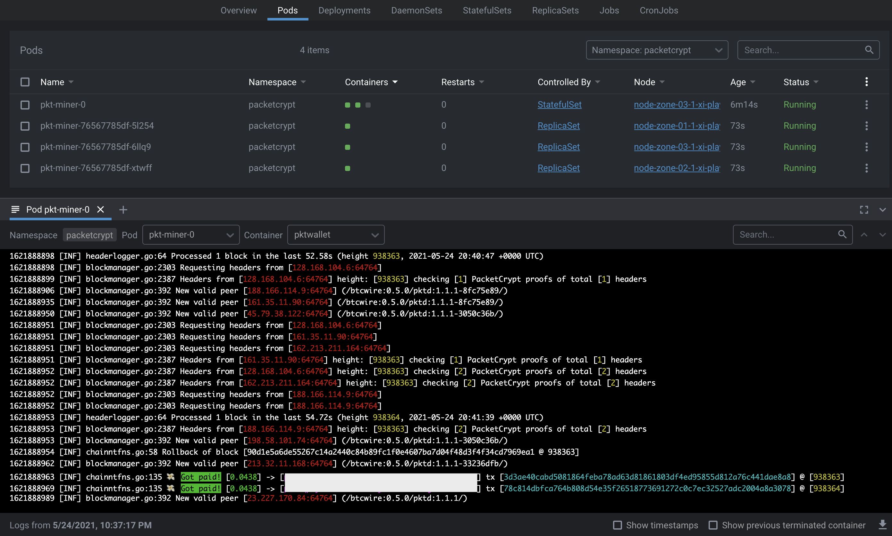
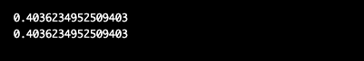

# pkt mining

You have to create a wallet, before you can mine.
If you have not created a wallet, you can create one in the next step.

## Screenshots

### pktwallet output



### Balance checker output



## Creating a wallet

```bash
  docker run -it --rm -v `pwd`:/pkt -v `pwd`:/pkt xcalizorz/pkt-miner:v0.1 pktwallet --create
```

Answer the questions and you should now find a `.pktwallet` folder in you working directory.

For more information, check the [official documentation](https://docs.pkt.cash/en/latest/pktd/pktwallet/#pktwallet).

## Mining with Docker

```bash
  docker run -it --rm -v path/to/.pktwallet:/pkt/.pktwallet -v `pwd`:/pkt xcalizorz/pkt-miner:v0.1 packetcrypt ann -p $WALLET_ADDRESS $POOL_ADDRESS
```

## Mining via Kubernetes

If you want to use Kubernetes, you need the following:

- A running Kubernetes instance
- At least one worker node with >= 3 CPUs

If using `kustomization` (`kubectl apply -k`) is not possible, you can just apply
files within [`k8s/`](k8s/) via `kubectl apply -f`.

### Must be done manually

#### Create namespace

Before you apply the files, create the namespace

```bash
  kubectl apply -f pkt/k8s/namespace.yaml
```

#### Touch secrets.yaml

You have to change the values in `secrets.yaml` to correspond with your own information.
E. g. set the right pool address and wallet address as `base64` encoded strings.

#### Apply files

```bash
  kubectl apply -k pkt/k8s
```

#### Bring in your wallet

Currently, you have to add your `wallet` to your volume manually.
Until these files are copied, the statefulset will have issues and restart.

```bash
  kubectl cp .pktwallet/pktwallet.conf packetcrypt/pkt-miner-0:/pkt/.pktwallet
  kubectl cp .pktwallet/rpc.cert packetcrypt/pkt-miner-0:/pkt/.pktwallet
  kubectl cp .pktwallet/rpc.key packetcrypt/pkt-miner-0:/pkt/.pktwallet

  kubectl cp .pktwallet/pkt packetcrypt/pkt-miner-0:/pkt/.pktwallet
```
